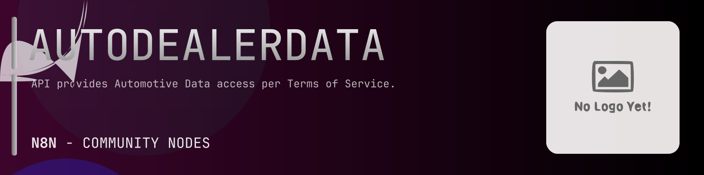

# @n8n-dev/n8n-nodes-autodealerdata



[](https://www.npmjs.com/package/@n8n-dev/n8n-nodes-autodealerdata)
[](https://opensource.org/licenses/MIT)

---

**Stop writing autodealerdata API integrations by hand.**

Every time you connect n8n to autodealerdata, you waste hours mapping endpoints, defining parameters, and debugging schemas. You copy-paste from docs, fix edge cases, and pray nothing breaks.

**What if connecting n8n to autodealerdata took 5 minutes, not half a day?**

This node gives you **12+ resources** out of the box: **Supply Data**, **Developer Plan Or Greater**, **Static Data**, **Starter Plan Or Greater**, **Dealership Data**, and 7 more: with full CRUD operations, typed parameters, and zero manual configuration.

---

## What You Get

- **Zero boilerplate**: Resources, operations, and fields are pre-configured and ready to use
- **Full CRUD**: Create, read, update, and delete support where the API allows it
- **Typed parameters**: No more guessing field types
- **Built-in auth**: API key authentication, ready to go
- **Declarative**: Native n8n performance, no custom execute() overhead

---

## Install

```bash
npm install @n8n-dev/n8n-nodes-autodealerdata
```

**Or in n8n:**
1. **Settings → Community Nodes → Install**
2. Search: `@n8n-dev/n8n-nodes-autodealerdata`
3. Click **Install**

---

## Quick Start

1. Install the node (above)
2. Add credentials: **autodealerdata API** → paste your API key
3. Drag the **autodealerdata** node into your workflow
4. Pick a resource → pick an operation → done.

That's it. No configuration files. No code. It just works.

---

## Resources

<details>
<summary><b>Supply Data</b> (2 operations)</summary>

- Get Days worth of supply left on dealer lots
- Get Days a vehicle takes to sell

</details>

<details>
<summary><b>Developer Plan Or Greater</b> (7 operations)</summary>

- Get Days worth of supply left on dealer lots
- Get Days a vehicle takes to sell
- Get Premium Dealers in a zip code
- Get Premium Dealers by ID
- Get Premium Dealers in a region
- Get Flexible Listing Search
- Get Premium Simple Vehicle Market Report Over Arbitrary Locations and Vehicles

</details>

<details>
<summary><b>Static Data</b> (4 operations)</summary>

- Get a list of brand names
- Get a list of model names including discontinued models
- Get a list of model names
- Get a list of region names

</details>

<details>
<summary><b>Starter Plan Or Greater</b> (12 operations)</summary>

- Get a list of brand names
- Get a list of model names including discontinued models
- Get a list of model names
- Get a list of region names
- Get Stats on ask price of new vehicles
- Get Used market share of model year by model
- Get Stats on sale price of new vehicles
- Get Histogram of sales price of new vehicles by model
- Get Premium Simple Vehicle Market Report
- Get Top models in a given region
- Get Premium Simple Vehicle History Report
- Get Vin decoder and Recall Info

</details>

<details>
<summary><b>Dealership Data</b> (3 operations)</summary>

- Get Premium Dealers in a zip code
- Get Premium Dealers by ID
- Get Premium Dealers in a region

</details>

<details>
<summary><b>Premium</b> (8 operations)</summary>

- Get Premium Dealers in a zip code
- Get Premium Dealers by ID
- Get Premium Dealers in a region
- Get Market share of all brands in region
- Get Premium Brand sales by region and month
- Get Premium Simple Vehicle Market Report
- Get Premium Simple Vehicle Market Report Over Arbitrary Locations and Vehicles
- Get Premium Simple Vehicle History Report

</details>

<details>
<summary><b>Sales Data</b> (6 operations)</summary>

- Get Market share of a brand in region
- Get Market share of all brands in region
- Get Used market share of model year by model
- Get Brand sales by region and Day
- Get Premium Brand sales by region and month
- Get Top models in a given region

</details>

<details>
<summary><b>Analyst Plan Or Greater</b> (11 operations)</summary>

- Get Market share of a brand in region
- Get Market share of all brands in region
- Get Listings by Dealer ID
- Get Listings by Dealer ID and Date
- Get Listings by Region
- Get Listings by Region and Date
- Get Listings by ZipCode
- Get Listings by ZipCode and Date
- Get Brand sales by region and Day
- Get Premium Brand sales by region and month
- Get Checks if a VIN appeared on the market on or after a given date

</details>

<details>
<summary><b>Authentication</b> (5 operations)</summary>

- Get all Sub User Keys associated with your account
- Get a JWT from your API credentials
- Post Get a JWT from your API credentials
- Post Generate a Sub User Key that can be used by your users to make API calls in frontend applications
- Put Revoke a Sub User Key associated with your account

</details>

<details>
<summary><b>Pricing Data</b> (5 operations)</summary>

- Get Stats on ask price of new vehicles
- Get Stats on sale price of new vehicles
- Get Histogram of sales price of new vehicles by model
- Get Premium Simple Vehicle Market Report
- Get Premium Simple Vehicle Market Report Over Arbitrary Locations and Vehicles

</details>

<details>
<summary><b>Vehicle Data</b> (12 operations)</summary>

- Get Listings by Dealer ID
- Get Flexible Listing Search
- Get Listings by Dealer ID and Date
- Get Listings by Region
- Get Listings by Region and Date
- Get Listings by ZipCode
- Get Listings by ZipCode and Date
- Get Premium Simple Vehicle Market Report
- Get Premium Simple Vehicle Market Report Over Arbitrary Locations and Vehicles
- Get Premium Simple Vehicle History Report
- Get Checks if a VIN appeared on the market on or after a given date
- Get Vin decoder and Recall Info

</details>

<details>
<summary><b>Application Acceleration</b> (1 operations)</summary>

- Get Checks if a VIN appeared on the market on or after a given date

</details>

---

## Why This Node?

**Without this node:**
- Hours of manual API integration
- Copy-pasting from autodealerdata docs
- Debugging auth, pagination, error handling
- Maintaining your own client code

**With this node:**
- Install → configure → use. 5 minutes.
- Auto-generated from the official autodealerdata OpenAPI spec
- Always up to date when the API changes
- Native n8n performance

---

## Auto-Generated
This node was auto-generated from the official **autodealerdata** OpenAPI specification using
[@n8n-dev/n8n-openapi-node-ultimate](https://github.com/kelvinzer0/n8n-openapi-node-ultimate),
then validated against the live API so you get accurate types and real parameters, not guesswork.

When the autodealerdata API updates, this node updates too.

---


## License

MIT © [kelvinzer0](https://github.com/n8n-code)
